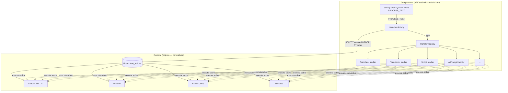
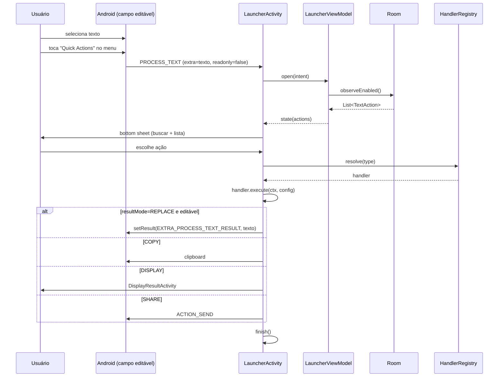
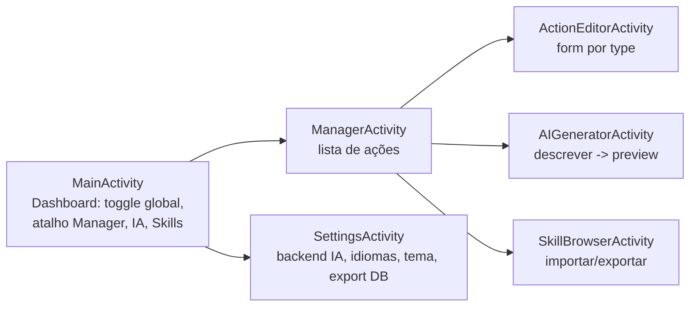

# TextTools X — Design de Software (SD)

| Campo | Valor |
|---|---|
| Status | Draft para implementação |
| Data | 2026-07-27 |
| Padrão | Interpretador (data-driven): APK = runtime; objetos (Room) = funcionalidades |
| ER de referência | `docs/spec/engineering-requirements.md` |

## 1. Visão Arquitetural

O APK é um **interpretador estável**; as funcionalidades são **objetos** persistidos.
Adicionar funcionalidade = autorar objeto, **não** compilar APK.



### Fronteiras (precisão honesta)
- **Compile-time**: o único alias de menu, os `ActionHandler`, a engine de script, o backend de IA.
- **Runtime**: `TextAction` (DB), config, skills, pipelines, ordem, enable.
- **Não há** nada entre esses dois que precise rebuild para nova funcionalidade
  (exceto novo tipo de handler nativo — raro, ver ER §8).

## 2. Estrutura de Pacotes (old → new)

```
com.corphish.quicktools/
  TextToolsApplication.kt            (mantém)
  actions/                           (NOVO — núcleo)
    model/
      TextAction.kt                  (Entity + DTO + ActionType + ResultMode + Source)
      ActionContext.kt               (input text, readonly flag, app context)
      ActionResult.kt                (sealed: Text/Copy/Display/Share/Error)
    handler/
      ActionHandler.kt               (interface)
      HandlerRegistry.kt             (resolve type -> handler)
      ActionTypeKey.kt               (Hilt map key)
      TranslateHandler.kt
      TransformHandler.kt
      ExtractHandler.kt
      AnalyzeHandler.kt
      TemplateHandler.kt
      FindReplaceHandler.kt
      ScriptHandler.kt               (QuickJS)
      AIPromptHandler.kt
      PipelineHandler.kt
    ai/
      AIBackend.kt                   (interface)
      CompletionRequest.kt / CompletionResponse.kt
      OpenAICompatBackend.kt         (OpenAI/OpenRouter/DeepSeek/LM Studio)
      GeminiBackend.kt
      OnDeviceBackend.kt             (MediaPipe LLM.inference)
      ActionGenerator.kt             (descrição -> TextAction JSON validado)
    skill/
      SkillCodec.kt                  (JSON <-> List<TextAction>)
      SkillImporter.kt / SkillExporter.kt
    script/
      QuickJsSandbox.kt              (engine + capability gate)
  data/                              (mantém Constants; adiciona)
    db/
      AppDatabase.kt                 (Room)
      TextActionDao.kt
      Converters.kt                  (List<String> <-> JSON)
  repository/
    ActionRepository.kt              (DAO wrapper + regras)
    LauncherRepository.kt            (enabled actions ordenadas)
    ContextMenuOptionsRepository.kt  (MANTÉM — toggle do único alias)
    SettingsRepository.kt            (MANTÉM)
  viewmodels/
    LauncherViewModel.kt
    ManagerViewModel.kt
    ActionEditorViewModel.kt
    AIGeneratorViewModel.kt
  activities/
    NoUIActivity.kt                  (MANTÉM)
    LauncherActivity.kt              (substitui OptionsActivity)
    MainActivity.kt                  (MANTÉM — entrada/config)
    ManagerActivity.kt               (gestão de ações)
    ActionEditorActivity.kt          (criar/editar ação)
    AIGeneratorActivity.kt           (gerar com IA)
    DisplayResultActivity.kt         (resultMode=DISPLAY)
  functions/                         (MANTÉM — vira impl dos handlers)
    TextFunctions.kt / NumberFunctions.kt / TextClassifierFunctions.kt / ...
  modules/
    AppModule.kt                     (expande: Room, handlers map, AI backend)
    HandlersModule.kt                (NOVO — @Binds @IntoMap por ActionType)
  ui/                                (MANTÉM theme; adiciona components)
    components/ ActionRow.kt / IconGallery.kt / OrderableList.kt
```

### Removidos
- `features/Feature.kt`, `activities/OptionsActivity.kt`,
  `viewmodels/OptionsViewModel.kt`, todas as `*Activity` de feature individuais
  (`TransformActivity`, `TextCountActivity`, `EvalActivity`, etc.).
- `AppMode.SINGLE/MULTI` (não há mais múltiplos aliases).

## 3. Modelo de Dados (Room)

### Entity
```kotlin
@Entity(
  tableName = "text_actions",
  indices = [Index("enabled"), Index("order")]
)
data class TextActionEntity(
  @PrimaryKey(autoGenerate = true) val id: Long = 0,
  val name: String,
  val description: String? = null,
  val type: ActionType,
  val resultMode: ResultMode = ResultMode.REPLACE,
  val configJson: String,
  val iconKey: String = "ic_action",
  val enabled: Boolean = true,
  val order: Int = 0,
  val tags: List<String> = emptyList(),
  val source: Source = Source.MANUAL,
  val createdAt: Long = System.currentTimeMillis(),
  val updatedAt: Long = System.currentTimeMillis(),
)
```

### DAO
```kotlin
@Dao
interface TextActionDao {
  @Query("SELECT * FROM text_actions WHERE enabled = 1 ORDER BY `order` ASC, name ASC")
  fun observeEnabled(): Flow<List<TextActionEntity>>

  @Query("SELECT * FROM text_actions ORDER BY `order` ASC, name ASC")
  fun observeAll(): Flow<List<TextActionEntity>>

  @Query("SELECT * FROM text_actions WHERE id = :id")
  suspend fun getById(id: Long): TextActionEntity?

  @Insert suspend fun insert(a: TextActionEntity): Long
  @Update suspend fun update(a: TextActionEntity)
  @Delete suspend fun delete(a: TextActionEntity)
  @Query("UPDATE text_actions SET enabled = :enabled, updatedAt = :ts WHERE id = :id")
  suspend fun setEnabled(id: Long, enabled: Boolean, ts: Long)
  @Query("UPDATE text_actions SET `order` = :order, updatedAt = :ts WHERE id = :id")
  suspend fun setOrder(id: Long, order: Int, ts: Long)
}
```

### Database
```kotlin
@Database(
  entities = [TextActionEntity::class],
  version = 1,
  exportSchema = true   // schema JSON em /schemas p/ auto-migration
)
@TypeConverters(Converters::class)
abstract class AppDatabase : RoomDatabase() {
  abstract fun textActionDao(): TextActionDao
}
```

### Migration policy
- `exportSchema = true` + `room.schemaLocation` → diffs versionados.
- Auto-migration preferida (`@AutoMigration`); fallback `Migration` manual.
- **Pre-migration hook**: export automático do DB p/ storage antes de qualquer
  migration destrutiva (segurança contra perda).

### Seed (default actions)
No primeiro launch, `ActionSeeder` insere um set padrão (Traduzir EN→PT,
UPPERCASE, Extrair URLs, Sort Lines, etc.) — todas `source=MANUAL`, editáveis.

## 4. Interfaces Core

```kotlin
enum class ActionType { TRANSLATE, TRANSFORM, EXTRACT, ANALYZE, TEMPLATE,
                        FIND_REPLACE, SCRIPT, AI_PROMPT, PIPELINE }
enum class ResultMode { REPLACE, COPY, DISPLAY, SHARE }
enum class Source { MANUAL, AI, IMPORTED }

data class ActionContext(
  val input: String,
  val readOnly: Boolean,           // EXTRA_PROCESS_TEXT_READONLY
  val appContext: Context,
)

sealed interface ActionResult {
  data class Text(val value: String) : ActionResult          // REPLACE/COPY
  data class Display(val renderable: Renderable) : ActionResult
  data class Share(val value: String, val mimeType: String) : ActionResult
  data class Error(val message: String) : ActionResult
}

interface ActionHandler {
  val type: ActionType
  suspend fun execute(ctx: ActionContext, config: JsonObject): ActionResult
}

class HandlerRegistry @Inject constructor(
  private val handlers: Map<ActionType, @JvmSuppressWildcards ActionHandler>
) {
  fun resolve(type: ActionType): ActionHandler =
    handlers[type] ?: error("No handler for $type")
}
```

### Hilt binding
```kotlin
@MapKey annotation class ActionTypeKey(val value: ActionType)

@Module @InstallIn(SingletonComponent::class)
abstract class HandlersModule {
  @Binds @IntoMap @ActionTypeKey(ActionType.TRANSLATE)
  abstract fun bindTranslate(h: TranslateHandler): ActionHandler
  // ... um bind por handler
}
```

## 5. Catálogo de Handlers — config schema

Cada handler documenta seu `configJson` (validado no editor + na geração por IA).

### TRANSLATE
```json
{ "from": "en", "to": "pt" }
```
ML Kit `Translator` (`RemoteModelDownload` sob demanda). Modelos cached.

### TRANSFORM
```json
{ "op": "BOLD_SANS" }
```
`op` ∈ enum de ~45 operações mapeadas para `TextFunctions`:
`UPPERCASE, LOWERCASE, TITLE_CASE, RANDOM_CASE, WRAP_SINGLE, WRAP_DOUBLE,
WRAP_PAREN, WRAP_BRACKET, WRAP_CUSTOM{chars}, SORT_LINES, REVERSE_LINES,
NUMBER_LINES, REMOVE_EMPTY_LINES, REMOVE_DUPLICATE_LINES, REVERSE_WORDS,
REVERSE_CHARS, ADD_PREFIX{text}, ADD_SUFFIX{text}, REMOVE_WHITESPACES,
REMOVE_LINEBREAKS, REPEAT{n}, BOLD_SERIF, ITALIC_SERIF, BOLD_ITALIC_SERIF,
BOLD_SANS, ITALIC_SANS, BOLD_ITALIC_SANS, STRIKETHROUGH_SHORT, STRIKETHROUGH_LONG,
CURSIVE, MONOSPACE, CLEAR_UNICODE, LINEBREAK_BY_CHARS{n}, LINEBREAK_BY_WORDS{n},
SQUEEZE{n}, PREPEND_LINES{text}, APPEND_LINES{text}, ...`.

### EXTRACT
```json
{ "pattern": "\\b[\\w.+-]+@[\\w.-]+\\.[A-Za-z]{2,}\\b", "join": "\n", "unique": true }
```
Saída: matches unidos por `join`. `pattern` pode ser preset (`EMAIL`, `URL`, `PHONE`,
`DATE`, `TIME`, `CURRENCY`, `BINARY`, `HEX`, `JSON`) vindo dos extractors existentes.

### ANALYZE
```json
{ "metrics": ["chars","letters","digits","words","wordFrequency","emails","urls"] }
```
Resultado `Display` (Renderable = seções chave→valor + listas).

### TEMPLATE
```json
{ "template": "https://google.com/search?q={{text}}", "encode": true }
```
`{{text}}` substituído; `encode` aplica `URLEncoder`.

### FIND_REPLACE
```json
{ "find": "foo", "replace": "bar", "regex": false, "ignoreCase": true, "all": true }
```
Reusa `text/TextReplacementManager`.

### SCRIPT
```json
{ "code": "return s.replace(/foo/g, 'bar').toUpperCase()", "capabilities": [] }
```
QuickJS: função `f(s)` recebe o texto, retorna string. `capabilities` ∈
`[]` (default, puro) | `["CLIPBOARD_READ"]` | `["HTTP_GET"]` (futuro). Sem capabilities
= sem acesso a nada além do input.

### AI_PROMPT
```json
{
  "backend": "openrouter",
  "model": "anthropic/claude-3.5-sonnet",
  "prompt": "Resuma em uma frase: {{text}}",
  "system": "Você é um editor conciso.",
  "jsonSchema": null,
  "temperature": 0.3,
  "maxTokens": 256
}
```
`{{text}}` injetado. `jsonSchema` não-nulo ativa modo estruturado (saída JSON validada).

### PIPELINE
```json
{ "steps": [12, 7, 3] }
```
Executa em ordem; saída de cada step = entrada do próximo. Falha em qualquer step
→ `Error` com step culpado. Não permite recursão (validação de DAG no save).

## 6. Fluxo do Launcher (sequence)



## 7. Plumbing de Replace in-place

```kotlin
// LauncherActivity (herda NoUIActivity)
override fun handleIntent(intent: Intent): Boolean {
  val text = intent.getCharSequenceExtra(Intent.EXTRA_PROCESS_TEXT)?.toString().orEmpty()
  val readOnly = intent.getBooleanExtra(Intent.EXTRA_PROCESS_TEXT_READONLY, false)
  // abrir UI; ao concluir:
  return false  // não auto-finish; LauncherActivity finaliza após ação
}

private fun applyResult(result: ActionResult, action: TextAction) {
  when (result) {
    is ActionResult.Text -> when (action.resultMode) {
      ResultMode.REPLACE -> if (!readOnly)
        returnResult(result.value) else copyToClipboard(result.value)
      ResultMode.COPY -> copyToClipboard(result.value)
      ResultMode.SHARE -> share(result.value)
      ResultMode.DISPLAY -> show(Display.from(result.value))
    }
    is ActionResult.Display -> show(result.renderable)
    is ActionResult.Share -> share(result.value)
    is ActionResult.Error -> toast(result.message)
  }
  finish()
}

private fun returnResult(text: String) {
  val data = Intent().putExtra(Intent.EXTRA_PROCESS_TEXT_RESULT, text)
  setResult(Activity.RESULT_OK, data)
}
```

**Limitação conhecida**: `EXTRA_PROCESS_TEXT_RESULT` substitui a seleção inteira; não
há API para substituição parcial/posicional. Documentado.

## 8. Subsistema de Geração por IA

```mermaid
flowchart LR
    D[Descrição do usuário] --> P[Prompt builder]
    P --> AI[AIBackend.complete<br/>JSON mode]
    AI --> V[Schema validator<br/>vs ActionType config]
    V -->|ok| PRE[Preview: executa sobre<br/>texto de exemplo]
    V -->|inválido| R[Retry c/ erro]<br/>R --> AI
    PRE -->|aprova| SAVE[Insert TextAction]
    PRE -->|rejeita| D
```

- `ActionGenerator.describe(prompt) -> TextActionDraft` (sem id, sem persistir).
- **Prompt system** documenta o schema de cada `ActionType` + exemplos; força JSON.
- Validação: `type` ∈ enum, `configJson` parseável e conforme schema do tipo.
- **Preview obrigatório**: roda o draft sobre 2-3 textos de exemplo antes de salvar.

## 9. Sistema de Skills

### Formato (JSON)
```json
{
  "format": "texttools-skill",
  "version": 1,
  "name": "Productivity Pack",
  "description": "...",
  "author": "...",
  "actions": [
    { "name": "Traduzir EN→PT", "type": "TRANSLATE",
      "resultMode": "REPLACE", "config": {"from":"en","to":"pt"}, "iconKey":"ic_translate" },
    { "name": "Extrair Emails", "type": "EXTRACT",
      "resultMode": "COPY", "config": {"pattern":"EMAIL","join":", "}, "iconKey":"ic_extract" }
  ]
}
```

### Operações
- **Importar**: `SkillImporter` valida schema + capabilities de SCRIPT (warning) →
  insere com `source=IMPORTED` + tag do skill. Dedup por `name` (pergunta sobrescrever).
- **Exportar**: seleção múltipla ou "todas" → `SkillExporter` grava em
  `getExternalFilesDir(Environment.DIRECTORY_DOCUMENTS)` ou `ACTION_CREATE_DOCUMENT`.
- **Compartilhar**: `ACTION_SEND` com `text/json` (cola no chat/email).
- **Pipeline**: skill com 1 action `type=PIPELINE` cujos `steps` referenciam ids
  locais do pack (renumerados na importação).

## 10. Manager UI (UX "pro")

### Princípios
- **Material 3 Expressive** (já no repo); dynamic color Material You.
- **One-thumb**: ações primárias ao alcance do polegar (FAB, bottom sheet).
- **Busca instantânea** em toda lista (filtro reduz o custo do "2 toques").
- **Drag-to-reorder** com haptics; toggle com switch; long-press = menu contextual.
- **Preview vivo**: todo editor de ação mostra resultado sobre texto de exemplo.

### Telas


- **LauncherActivity**: bottom sheet translúcido, campo de busca no topo, lista de
  `ActionRow` (ícone + nome + tag), haptics no toque. Vazio → CTA "criar ação".
- **ManagerActivity**: `LazyColumn` com `OrderableList`; FAB "+"; filtros (tipo/tag/origem).
- **ActionEditorActivity**: form dinâmico por `type` (cada handler expõe um
  `@Composable configEditor()`); live preview.
- **AIGeneratorActivity**: textarea de descrição + chips de sugestão + painel de
  preview + diff contra exemplo.

## 11. Estratégia de Persistência

- **Primário**: Room interno (`/data/user/0/<pkg>/databases/`). Fonte de verdade.
- **Portabilidade**:
  - Export JSON (Settings → "Exportar tudo") → `ACTION_CREATE_DOCUMENT`.
  - Import JSON → merge com dedup.
  - `android:allowBackup="true"` (já no manifest) → Auto Backup p/ Google Drive do usuário.
- **Recomendação ER §12.1**: interno (seguro, sem permissão de storage). Externo
  editável direto só via export/import (evita Scoped Storage friction no Android 11+).

## 12. Engine de Script — QuickJS sandbox

- Lib: `io.github.dokar3:quickjs-kt` (Kotlin multiplatform, mantido) ou
  `app.cash.quickjs` (legacy). Avaliar no spike da fase 1.
- **API exposta ao script**: `function transform(s, ctx) { return ... }`.
- **Capability model** (default = nada):
  | Capability | API |
  |---|---|
  | (nenhuma) | só `s` e primitivos JS |
  | `HTTP_GET` | `ctx.httpGet(url)` |
  | `CLIPBOARD_READ` | `ctx.clipboard` |
- Timeout de execução (default 2 s) + limite de memória. Erro → `ActionResult.Error`.
- R8 keep rules para a engine em `proguard-rules.pro`.

## 13. Abstração de AI Backend

```kotlin
interface AIBackend {
  val id: String
  suspend fun complete(req: CompletionRequest): CompletionResponse
}

data class CompletionRequest(
  val prompt: String,
  val system: String? = null,
  val model: String,
  val jsonSchema: JsonObject? = null,
  val temperature: Float = 0.3f,
  val maxTokens: Int = 512,
)

data class CompletionResponse(val text: String, val tokensIn: Int, val tokensOut: Int)
```

### Providers (Hilt, selecionável em Settings)
| Provider | Quando |
|---|---|
| `OpenAICompatBackend` | default — funciona com OpenAI, OpenRouter, DeepSeek, Groq, LM Studio local (`baseUrl` + apiKey) |
| `GeminiBackend` | se usuário preferir Google |
| `OnDeviceBackend` | MediaPipe `LlmInference` (Gemma) — offline, privacidade |

Credenciais em `EncryptedSharedPreferences` (Tink via `androidx.security:security-crypto`).

## 14. Modelo de Segurança

| Vetor | Controle |
|---|---|
| Script malicioso em skill importada | QuickJS sandbox; capabilities default vazias; warning UI na importação de scripts com caps |
| IA vazando texto | backend explícito por ação; texto só sai pela action escolhida; sem telemetria |
| Credenciais de API | `EncryptedSharedPreferences` |
| DB corrompido em migration | export automático pré-migration + `fallbackToDestructiveMigration(onMigration)` com backup |
| Skill com PIPELINE cíclico | validação DAG no save (DFS detecta ciclo) |

## 15. Build & Release

- **Debug**: `./gradlew assembleDebug` → `app/build/outputs/apk/debug/app-debug.apk`.
  Instalar: `termux-open` (sideload). Sem keystore.
- **Release**: `./gradlew assembleRelease` com env `KEYSTORE_FILE/KEYSTORE_PASSWORD/KEY_ALIAS/KEY_PASSWORD`
  (já em `build.gradle.kts`). R8 minify + shrink (já habilitados).
- **CI**: `.github/workflows/release.yml` (do fork) builda APK assinado em tag.
- **R8 keep**:
  - Handlers (reflection via Hilt — já coberto pelo plugin).
  - QuickJS entrypoints, `JsonObject`/serialização skill, Room.
- `versionName` bump + `changelogs/vX.Y.Z.txt` por release.

## 16. Migração do TextTools atual

### Estratégia
1. Branch `cnmfs/texttools-x` a partir de `cnmfs/merged-workflow`.
2. **Fase 0 (scaffold)**: adicionar Room + depências; criar `actions/` vazio;
   `AppDatabase`; `AppModule` expandido. Build verde.
3. **Fase 1 (núcleo)**: `TextAction` + `HandlerRegistry` + `LauncherActivity`
   + handlers `TRANSFORM`/`EXTRACT` (reusando `TextFunctions`) + 1 alias no manifest.
   Remover `OptionsActivity`/`Feature.LIST`/aliases das 9 features. AC-1..AC-3.
4. **Fase 2 (gestão)**: Manager + Editor + seed default. AC-5.
5. **Fase 3 (IA)**: `AIBackend` + OpenAI-compat + `ActionGenerator` + UI. AC-6.
6. **Fase 4 (skills/script)**: `SCRIPT` (QuickJS) + skill codec + import/export + pipeline. AC-7, AC-8.
7. **Fase 5 (translate + display)**: `TRANSLATE` (ML Kit) + `ANALYZE`/`DISPLAY`. AC-4.
8. **Fase 6 (polish)**: drag-reorder, busca, haptics, acessibilidade, onboarding.

### Remoção explícita (limpeza)
- `features/Feature.kt`, `activities/OptionsActivity.kt`, `viewmodels/OptionsViewModel.kt`.
- As 9 `*Activity` de feature e seus ViewModels/UseCases associados.
- `_multiFeatureAliasMapping` (vira 1 alias), `AppMode`.
- `functions/` **permanece** (alimentam handlers).

## 17. Fases de Implementação (milestones)

| Fase | Entrega | Critério de saída |
|---|---|---|
| 0 | Scaffold (Room, deps, pacotes) | `assembleDebug` verde |
| 1 | Núcleo: launcher + TRANSFORM + EXTRACT | AC-1, AC-2, AC-3 (replace) |
| 2 | Manager + Editor + seed | AC-5 |
| 3 | IA: backend + generator + preview | AC-6 |
| 4 | SCRIPT (QuickJS) + skills + pipeline | AC-7, AC-8 |
| 5 | TRANSLATE (ML Kit) + ANALYZE/DISPLAY | AC-4 |
| 6 | Polish UX, onboarding, a11y | NFR-6 |

Cada fase = branch curto + PR p/ `cnmfs/texttools-x`. Build APK + smoke test no device.

## 18. Estratégia de Testes

- **Unit (JVM)**: handlers puros (`TRANSFORM`, `EXTRACT`, `TEMPLATE`, `FIND_REPLACE`)
  com table-driven sobre `TextFunctions` existente; `SkillCodec` round-trip;
  `ActionGenerator` schema validation; DAG cycle detection.
- **Robolectric**: `LauncherViewModel` (Flow do DB), replace plumbing.
- **Instrumented (`androidTest`)**: Room migration + DAO; QuickJS sandbox; replace
  in-place num `EditText` de teste.
- **Smoke manual** (device): selecionar texto em apps reais (WhatsApp, Chrome,
  Keep) → cada handler. Sem emulador no ambiente Termux.
- Cobertura alvo dos handlers puros: alta (lógica determinística); UI: manual.

## 19. Tabela de Decisões Técnicas

| Decisão | Escolha | Alternativa rejeitada | Por quê |
|---|---|---|---|
| Padrão | Interpretador (objeto=funcionalidade) | 1 Activity por feature (status quo) | Elimina rebuild p/ nova ação |
| Menu entry | 1 alias launcher | N aliases nomeados (Design B puro) | Zero rebuild vence 1 toque extra |
| Persistência | Room interno + export/import | SQLite cru / DataStore | Flow reativo + migrations + type-safe |
| Script | QuickJS sandboxed | DEX loading / DSL próprio | Android 14+ restringe DEX; DSL limita |
| IA default | OpenAI-compat (configurável) | Lock-in Google/OpenAI | Um provider cobre muitos backends |
| Tradução | ML Kit on-device | API de tradução | Offline, grátis, sem key |
| Skills | JSON textual | SQLite file binary | Auditável, compartilhável, diff-able |
| Reuso | Fork-and-refactor | Greenfield | ~50% do esqueleto é reutilizável |

## 20. Dependências a Adicionar (`gradle/libs.versions.toml`)

```toml
[versions]
room = "2.6.1"
quickjsKt = "..."        # spike fase 4
mlkitTranslate = "17.0.3"
securityCrypto = "1.1.0-alpha06"
kotlinxSerializationJson = "1.6.3"
retrofit = "2.11.0"      # p/ OpenAI-compat (ou ktor)

[libraries]
room-runtime = { module = "androidx.room:room-runtime", version.ref = "room" }
room-ktx = { module = "androidx.room:room-ktx", version.ref = "room" }
room-compiler = { module = "androidx.room:room-compiler", version.ref = "room" }
mlkit-translate = { module = "com.google.mlkit:translate", version.ref = "mlkitTranslate" }
security-crypto = { module = "androidx.security:security-crypto", version.ref = "securityCrypto" }
kotlinx-serialization-json = { module = "org.jetbrains.kotlinx:kotlinx-serialization-json", version.ref = "kotlinxSerializationJson" }
quickjs-kt = { module = "io.github.dokar3:quickjs-kt", version.ref = "quickjsKt" }
```

KSP já no projeto (Hilt); adicionar `room-compiler` via KSP.
Plugin `kotlinx-serialization` no `plugins {}`.

## 21. Open items que ainda dependem do usuário (ER §12)

Confirmar antes da Fase 0:
1. Persistência interna (recomendado) ✓?
2. Set de 9 handlers ✓?
3. Backend de IA: OpenAI-compat configurável (recomendado) ✓?
4. QuickJS (recomendado) ✓?

Após confirmar, a Fase 0 pode iniciar imediatamente.
