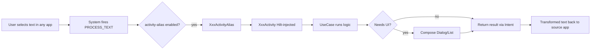

# TextTools — Extension Skill

Knowledge for extending `com.corphish.quicktools` (this repo, fork of
`corphish/TextTools`). Use whenever you add, change, or remove a feature that
appears in the Android text-selection context menu, or build/ship an APK.

## When to Use

- Add a new productivity feature to the text-selection context menu.
- Modify an existing feature (behavior, UI, strings, icon).
- Remove or hide a feature.
- Build a debug/release APK.
- Sync this fork with upstream (`corphish/main`).

## App at a Glance

- **What**: Android app that injects tools into the system text-selection
  context menu (the menu shown when you select text in any app).
- **Trigger mechanism**: `<intent-filter>` with `android.intent.action.PROCESS_TEXT`
  + `mimeType="text/plain"` declared on an `activity-alias`. The OS fires this
  intent when the user picks the menu entry.
- **Stack**: Jetpack Compose + Material 3 (Material You), MVVM
  (`ViewModel` + `StateFlow`), Hilt DI, Kotlin JVM 17.
- **SDK**: `compileSdk`/`targetSdk = 37`, `minSdk = 29` (Android 10+).
- **Version**: 2.2.3 (`versionCode` 33) in `app/build.gradle.kts`.
- **Fork-only additions** (no app-code changes vs upstream): fork-sync-merge
  tooling (`scripts/`, `gh-fork-sync-merge`, `docs/`) and the release CI
  (`.github/workflows/release.yml`).

## Evolution: TextTools X (feature-as-object, no-rebuild)

The app is evolving from "1 Activity per compiled feature" to an **interpreter
pattern**: the APK is a stable runtime; functionalities are **objects** (Room
rows). Adding a feature = authoring an object, NOT rebuilding the APK.

**Hard Android constraint (unchanged)**: the number of items in the
text-selection menu = static `activity-alias` count in the manifest. Unlimited
items directly in the menu is IMPOSSIBLE. Unlimited **actions** live **inside**
a single launcher entry that reads objects from Room.

| Operation | Object/DB? | Rebuild? |
|---|---|---|
| Enable / disable / reorder / rename / configure | yes | no |
| New instance of an existing handler type (TRANSLATE pair, transform, AI prompt) | yes | no |
| AI-generated action / imported skill | yes | no |
| New **handler type** (new native engine) | needs code | yes (one-time, rare) |

**Source of truth for the new architecture**:
- `docs/spec/engineering-requirements.md` — FR/NFR, reuse audit, acceptance.
- `docs/spec/software-design.md` — data model, handler registry, phases, deps.

The 9-point extension pattern below describes the **current/legacy** compiled-feature
model. New work should target the feature-as-object model above.

## Operational reality (verified this build — 2026-07-27)

See `docs/SESSION_HANDOFF.md` for full checkpoint. Key facts:
- **Build**: Gradle 9 breaks on Termux (`SystemInfo` service). Build **via CI**
  (`.github/workflows/debug-apk.yml` on `cnmfs/**`), then re-sign with `apksigner`
  using `~/.cnmfs-keystore/cnmfs-keystore.jks` (alias `cnmfs-release`). Never run
  `./gradlew` locally here.
- **Launcher entry**: `OptionsActivity` renders the dynamic list **inline** (translucent
  + `setContent`), matching the original TextTools pattern. Do NOT reintroduce
  for-result delegation to a separate launcher activity.
- **Mode MUST be SINGLE**: `TextToolsApplication.onCreate` forces `AppMode.SINGLE`
  every start. A cloud-restored legacy `MULTI` pref (from prior corphish installs of
  the same package) otherwise re-enables the 9 legacy aliases and hides the launcher.
- **Replace result**: returned in BOTH `Intent.EXTRA_PROCESS_TEXT` and the literal
  `"android.intent.extra.PROCESS_TEXT_RESULT"` (the constant didn't resolve).
- **5 handlers live**: TRANSFORM, EXTRACT, FIND_REPLACE, TEMPLATE, ANALYZE. The other
  4 (TRANSLATE, SCRIPT, AI_PROMPT, PIPELINE) are reserved in the enum — add them in
  the same `HandlerRegistry` with zero architectural change.


## Architecture Layers

```
activities/   -> Compose UI + intent handling (entry points)
  viewmodels/   -> StateFlow state owners (Hilt-injected)
  usecases/     -> Single-purpose orchestration
  repository/   -> Interface + Impl (data access, prefs, PackageManager)
  functions/    -> Pure logic (text/number transforms, classifiers)
  data/         -> Plain data classes + Constants
  features/     -> Feature catalog (Feature.LIST)
  modules/      -> Hilt @Module (AppModule)
  text/         -> Text replacement engine
  extensions/   -> Kotlin extensions
  ui/{common,theme} -> Reusable Compose components + Material You theme
```

## The 9-Point Extension Pattern

Every feature touches these 9 places. Missing any one = the feature silently
fails to show or to toggle.

| # | File | What to add |
|---|------|-------------|
| 1 | `app/src/main/java/com/corphish/quicktools/repository/ContextMenuOptionsRepository.kt` | New entry in the `FeatureIds` enum |
| 2 | `app/src/main/java/com/corphish/quicktools/features/Feature.kt` (`Feature.LIST`) | `Feature(id, icon, featureTitle, featureDesc, contextMenuText)` |
| 3 | `app/src/main/java/com/corphish/quicktools/repository/ContextMenuOptionsRepositoryImpl.kt` (`_multiFeatureAliasMapping`) | Map `FeatureIds.XXX -> packageName + ".activities.XxxActivityAlias"` |
| 4 | `app/src/main/java/com/corphish/quicktools/activities/OptionsActivity.kt` (`_options`) | `Option(FeatureIds.XXX, R.string.xxx, R.drawable.ic_xxx, XxxActivity::class.java, requiresEditable)` (single-mode router) |
| 5 | `app/src/main/java/com/corphish/quicktools/activities/XxxActivity.kt` | New Activity `@AndroidEntryPoint`, extends `NoUIActivity` (no UI) or `ComponentActivity` (Compose UI) |
| 6 | `app/src/main/AndroidManifest.xml` | `<activity android:name=".activities.XxxActivity" .../>` + `<activity-alias android:name=".activities.XxxActivityAlias" android:enabled="false" android:exported="true" android:targetActivity=".activities.XxxActivity">` with the `PROCESS_TEXT` and `VIEW` intent-filters |
| 7 | `app/src/main/java/com/corphish/quicktools/usecases/XxxUseCase.kt` | Logic, `@Inject constructor(...)`, injected into the ViewModel |
| 8 | `app/src/main/res/values/strings.xml` | `<string name="xxx_title">`, `xxx_desc`, `context_menu_xxx` (+ translations under `res/values-<lang>/`) |
| 9 | `app/src/main/res/drawable/` | Icon `ic_xxx.xml` (vector drawable) |

### Canonical manifest block (copy & rename)

```xml
<activity
    android:name=".activities.XxxActivity"
    android:excludeFromRecents="true"
    android:exported="false"
    android:label="@string/context_menu_xxx"
    android:theme="@style/Theme.AppCompat.Translucent" />

<activity-alias
    android:name=".activities.XxxActivityAlias"
    android:enabled="false"
    android:exported="true"
    android:label="@string/context_menu_xxx"
    android:targetActivity=".activities.XxxActivity">
    <intent-filter android:label="@string/context_menu_xxx">
        <action android:name="android.intent.action.PROCESS_TEXT" />
        <category android:name="android.intent.category.DEFAULT" />
        <data android:mimeType="text/plain" />
    </intent-filter>
    <intent-filter android:label="@string/context_menu_xxx">
        <action android:name="android.intent.action.VIEW" />
        <category android:name="android.intent.category.DEFAULT" />
        <category android:name="android.intent.category.BROWSABLE" />
        <data android:scheme="https" />
    </intent-filter>
</activity-alias>
```

Notes:
- `android:enabled="false"` on the alias is REQUIRED. The app flips it on/off
  via `PackageManager.setComponentEnabledSetting(...)` when the user
  enables/disables the feature in Settings. That is how the menu entry appears
  or hides.
- `android:exported="true"` on the alias is REQUIRED (the system fires the
  intent from outside the app).
- `PROCESS_TEXT` makes it appear on text selection; the `VIEW`/`https` filter
  is a secondary entry (share/open) — keep it for parity with existing features.

### Flow of a feature



## Adding Multiple Features in One Pass

Features are independent (no cross-imports). To add N at once:

1. **Shared registrations FIRST** (single edit each, batched in one turn to
   avoid cherry-pick conflicts on the same file):
   - `FeatureIds` (file #1) — append all new IDs.
   - `Feature.LIST` (file #2) — append all entries.
   - `_multiFeatureAliasMapping` (file #3) — append all mappings.
   - `OptionsActivity._options` (file #4) — append all Options.
   - `AndroidManifest.xml` (file #6) — append all activity + alias blocks.
   - `strings.xml` (file #8) — append all strings.
2. **Per-feature files in PARALLEL** (safe to delegate to subagents): Activity
   (#5), UseCase (#7), drawable (#9) for each feature. These never touch the
   same file, so they run concurrently without conflict.

This ordering exists because the registration files are append-only hot spots:
touching them once with all features is cheaper than N sequential edits that
each re-read and re-anchor.

## Feature Complexity Tiers

| Tier | Files | Example | Notes |
|------|-------|---------|-------|
| Quick | 9 (Activity = `NoUIActivity`, no UI) | WhatsApp (open `wa.me`) | Fire-and-forget; process text, return result |
| Medium | 9 + Compose dialog | Transform, Find&Replace | Show options list, act on pick |
| Heavy | 9 + Compose screen + repo | Text Count, Number Analysis | Dedicated Repository + functions for analysis |

Classify a new feature into a tier before estimating. Quick/Medium follow the
template directly; Heavy adds a `Repository`/`RepositoryImpl` pair and a
`functions/` module of pure logic.

## Build & Ship

### Build locally (Termux)

```bash
# Debug APK (unsigned, for device install/test) — no keystore needed
./gradlew assembleDebug
# Output: app/build/outputs/apk/debug/app-debug.apk

# Release APK (signed) — needs keystore env vars
KEYSTORE_FILE=... KEYSTORE_PASSWORD=... KEY_ALIAS=... KEY_PASSWORD=... \
  ./gradlew assembleRelease
# Output: app/build/outputs/apk/release/app-release.apk
```

No `/tmp` on Termux — use `$TMPDIR` for any scratch files.

### Install on device

```bash
termux-open app/build/outputs/apk/debug/app-debug.apk
```

### Release via CI (fork workflow)

Push a tag `vX.Y.Z` to trigger `.github/workflows/release.yml`, which builds a
signed release APK. Bump `versionCode`/`versionName` in `app/build.gradle.kts`
and add a `changelogs/vX.Y.Z.txt` first.

## Sync Fork with Upstream

This fork keeps `main` as a mirror of `corphish/main`; custom work lives on
`cnmfs/merged-workflow`. To resync:

```bash
# Option A — interactive gh extension
gh fork-sync-merge corphish main cnmfs

# Option B — raw script
./scripts/fork-sync-merge.sh corphish main cnmfs

# Option C — manual rebase (ongoing parallel growth)
git fetch corphish main
git checkout cnmfs/merged-workflow
git rebase corphish/main
git push origin cnmfs/merged-workflow --force-with-lease
```

See `docs/fork-sync-merge-workflow.md` for the full rationale. Rule: never
commit directly to `main`; never drop the `cnmfs/backup-fork-sync` branch.

## Project Conventions

- **Output language**: Brazilian Portuguese, technical register, unless the
  user asks otherwise. (App strings themselves stay English-translated via
  Crowdin; do not hardcode PT in `strings.xml`.)
- **No emojis** in code, commits, or PR comments.
- **Git**: only stage files you changed this session. Stage explicit paths
  (`git add <path>`), never `git add -A`/`.`. Multiple omp sessions may edit
  this repo concurrently.
- **Commit format**: `{feat,fix,docs}[(app,actions,gradle,metadata)]: <msg>`.
- **ProGuard**: release build is minified + shrunk (`isMinifyEnabled = true`).
  If a feature uses reflection, add keep rules in `app/proguard-rules.pro`.
- **DI**: every Activity/ViewModel gets `@AndroidEntryPoint` / `@HiltViewModel`.
  Pure logic goes in `functions/` (testable, no Android deps); orchestration in
  `usecases/`; Android-bound access in `repository/`.

## Verification Checklist (per new feature)

- [ ] Compiles: `./gradlew assembleDebug` succeeds.
- [ ] Menu entry appears on text selection (install APK, select text in any app).
- [ ] Toggle works: disable the feature in Settings -> entry disappears from menu.
- [ ] Single-mode and Multi-mode both route to the new Activity.
- [ ] No `ActivityNotFoundException` or crash in logcat on invocation.
- [ ] Strings present in `strings.xml` (and translated files if applicable).
- [ ] Icon renders (vector drawable, no missing-resource warning).
